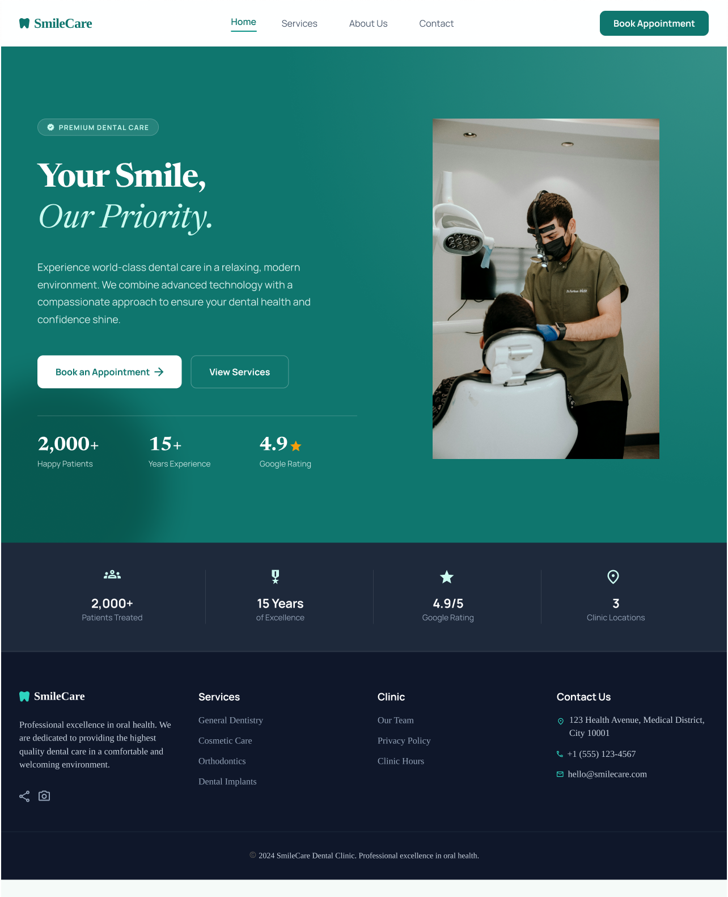
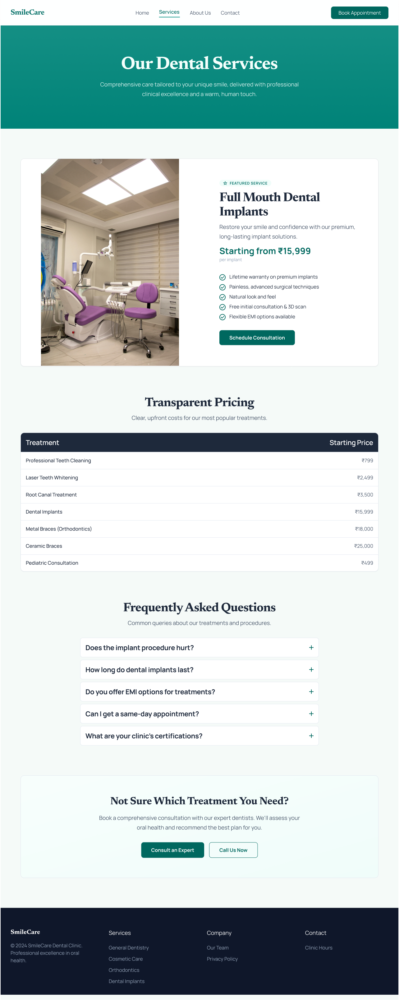
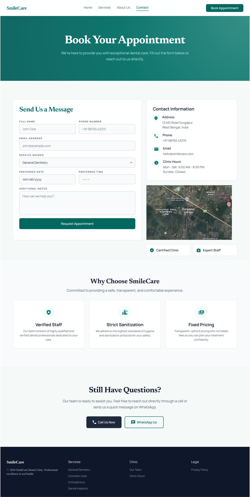

# SmileCare Dental Clinic – Website Redesign

## 📌 Overview

This project is part of the UI/UX Internship Task 1.

The goal was to redesign a local service business website with a focus on:

* Lead generation
* Conversion optimization
* User-friendly experience

---

## 🎯 Pages Designed

* Homepage (Desktop + Mobile)
* Service Page (Desktop + Mobile)
* Contact / Lead Page (Desktop + Mobile)

---

## 🎨 Figma Design

[View Figma File]([https://www.figma.com/design/Qs82cKOa43Ez7o0U7e6sKx/UIUX-Task-1?node-id=0-1&p=f&t=aUQ2sU1X6FIq9kmA-0])

---

## 🖼️ Screenshots

### Homepage



### Service Page



### Contact Page



---

## 🧠 Key Focus Areas

* Clear value proposition
* Strong call-to-action placement
* Trust elements (reviews, credentials)
* Simplified lead capture form
* Mobile responsiveness

---

## 📂 Project Structure

```
designs/
  figma-link.txt
  Screenshots/

rationale/
  design-rationale.md
```

---

## 🚀 Outcome

The redesign improves clarity, builds trust, and guides users toward booking appointments efficiently.
